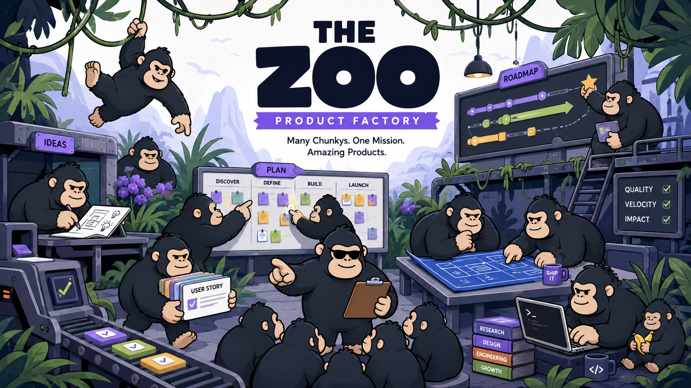

# The Zoo



A standalone product-factory desktop app.
Electrobun shell (bun-based), React 19 + Vite + Tailwind v4 webview, UI kit on
**@base-ui/react**. The Zoo runs its own isolated Chunky server over authenticated
HTTP + SSE (`@chunky/protocol`), so Zoo threads do not appear in the Chunky app.

## Run

```sh
cd ~/Downloads/the-zoo
bun install
bun run dev        # vite (HMR) + electrobun window
```

- `bun run dev` opens the native Electrobun window; it loads the Vite dev
  server (http://localhost:5173) when reachable, else the bundled `dist/`.
- `bun run dev:web` — web-only fallback: plain Vite in a browser.
- `bun run build` — vite build + `electrobun build` (packaged .app).
- `bun run typecheck` — TS7 native preview (`tsgo`); `typecheck:tsc` for classic tsc.

First `electrobun dev` downloads the platform core (dist-macos-arm64) — the
very first invocation may exit after downloading; just run it again.

## Install

macOS on Apple Silicon (arm64) is currently the supported release target:

```sh
curl -fsSL https://raw.githubusercontent.com/mkh09353/the-zoo/main/scripts/install.sh | bash
```

The installer downloads the latest release DMG and installs `The Zoo.app` in
`/Applications`. It preserves quarantine metadata for signed releases and only
removes it for unsigned releases. If `/Applications` is not writable by your
account, use the manual install instead. To install manually, download
[`stable-macos-arm64-TheZoo.dmg`](https://github.com/mkh09353/the-zoo/releases/latest/download/stable-macos-arm64-TheZoo.dmg),
open it, and copy `The Zoo.app` to `/Applications`.

## Releases

The Zoo checks GitHub Releases for updates shortly after launch and from
**The Zoo → Check for Updates…**. Available updates download in the background
and are installed after confirmation.

To cut a release, update the `version` in `package.json`, then create and push
the matching tag:

```sh
git tag vX.Y.Z
git push origin vX.Y.Z
```

The release workflow verifies the tag matches `package.json`, runs the stable
macOS arm64 build, and publishes every Electrobun artifact from `artifacts/` to
the GitHub Release. The updater polls
`https://github.com/mkh09353/the-zoo/releases/latest/download/stable-macos-arm64-update.json`.

The first standalone Zoo release is `v0.4.0`; the version jump distinguishes it
from the earlier builds that still used the Chunky app identity and state root.
Use `v0.4.1` or newer on macOS; it fixes the complete app-bundle seal and the
unsigned installer's Gatekeeper handling.

Unsigned builds carry a complete ad-hoc signature so macOS can verify the app
bundle is internally intact. Because an ad-hoc signature is not trusted by
Gatekeeper, use the Terminal installer above; it removes quarantine only when a
trusted Developer ID signature is absent.

The Zoo installs alongside Chunky with a separate bundle identifier and uses
`~/.zoo/state` for its desktop state, server discovery, auth, settings, and
Chunky session databases. It may reuse the immutable Chunky runtime under
`~/.chunky/app`, but it launches a separate dynamically-ported server process.
Running both apps at once therefore keeps their thread lists isolated.

### macOS signing and notarization setup

Tag releases sign and notarize with `xcrun notarytool` when this repository has
the Apple secrets below. Until then, the workflow publishes an unsigned DMG and
the installer removes quarantine after verifying that no valid signature is
present. Local `bun run build` is also unsigned. To enable signed releases,
create a **Developer ID Application** certificate in the Apple
Developer portal for the team, export it from Keychain Access as a passworded
`.p12`, and base64 encode it without line wrapping:

```sh
base64 < developer-id-application.p12 | tr -d '\n'
```

Create an app-specific password for the Apple ID used to submit notarization
(`appleid.apple.com`), and record that Apple Developer Team ID. Add these
repository secrets with these exact names and values:

| Secret | Value |
| --- | --- |
| `APPLE_CERTIFICATE_P12_BASE64` | Single-line base64 of the exported Developer ID Application `.p12`. |
| `APPLE_CERTIFICATE_PASSWORD` | Password assigned while exporting that `.p12`. |
| `APPLE_KEYCHAIN_PASSWORD` | A new random password used only for the throwaway CI keychain. |
| `ELECTROBUN_DEVELOPER_ID` | Exact signing identity shown by `security find-identity`, e.g. `Developer ID Application: Your Name (TEAMID)`. |
| `ELECTROBUN_APPLEID` | Apple ID email address authorized for notarization. |
| `ELECTROBUN_APPLEIDPASS` | App-specific password created for that Apple ID. |
| `ELECTROBUN_TEAMID` | Ten-character Apple Developer Team ID. |

After adding the secrets, set the repository variable `ZOO_SIGN_RELEASE=1` to
enable the signing/import/notarization steps. Leaving it unset publishes an
unsigned release.

The workflow imports the certificate into a temporary keychain, grants
`codesign` access, then deletes the keychain in an `always()` cleanup step.
Electrobun signs the app bundles and DMG with hardened runtime, submits each
for notarization, and staples the results. Its built-in default entitlements
already allow Bun's JIT, unsigned executable memory, and dynamic library
loading, so this app does not add an entitlements file.

## Server connection (Phase 0)

| Mode | Base URL | Auth token |
|------|----------|------------|
| Vite dev (`dev:web` / HMR) | Same-origin `/chunky-api` proxy → Chunky server (default `http://localhost:4620`, override with `CHUNKY_URL`) | Vite reads `~/.chunky/state/settings.json` (or `CHUNKY_SETTINGS`) and attaches the bearer header server-side. The token is not embedded in the renderer bundle. |
| Electrobun window (dev) | Uses the same Vite `/chunky-api` proxy while HMR is active. | Attached by Vite server-side. |
| Electrobun packaged view | Bun process RPC `getConfig` → `{ baseUrl, serverToken, workspace }` (reads settings + `CHUNKY_URL`/`CHUNKY_PORT`) | Runtime only via RPC — production `vite build` does **not** embed the token in `dist/`. |
| Fallback | `public/chunky-config.json` (`baseUrl` only — do not put tokens in this file) | Dev define token if present; otherwise RPC. |

Force-token-in-bundle (local debugging only): `CHUNKY_INJECT_TOKEN=1 bun run build:web`. Do not ship that.

If the server is unreachable, the app shows a connection banner with **Retry**
and an explicit **Demo mode** that keeps the polished mock UI offline. Live
server state is the default whenever connected.

## What's inside

- **Live client** (`src/mainview/lib/api.ts`, `transcript.ts`, `reconnect.ts`) —
  sessions list/create, SSE transcript reduce, send/interrupt, model picker.
- **Theme** — Zoo brand purple, dark default, pre-paint bootstrap in `index.html`.
- **Brand** (`assets/brand/`) — `the-zoo.png` is the native app/icon artwork;
  the Chunky "Minimal Purple" mark remains the executor identity inside chat.
  `bun run icons` mechanically derives the 10-file `assets/icon.iconset/` from
  the Zoo artwork, and `bun run icons:check` fails if the native icons or the
  verbatim in-chat Chunky mark drift from their approved sources.
- **UI kit** (`src/mainview/components/ui/`) — button, input, textarea, dialog,
  dropdown-menu, tooltip, scroll-area, kbd, skeleton, switch, separator.
- **Screens** — sidebar (real sessions when live), chat view with code blocks +
  streaming caret, composer (real models), ⌘K palette, settings (connection info).

## Keyboard

⌘K palette · ⌘, settings · ⌘N new thread · Enter send / Shift-Enter newline · Esc stop
